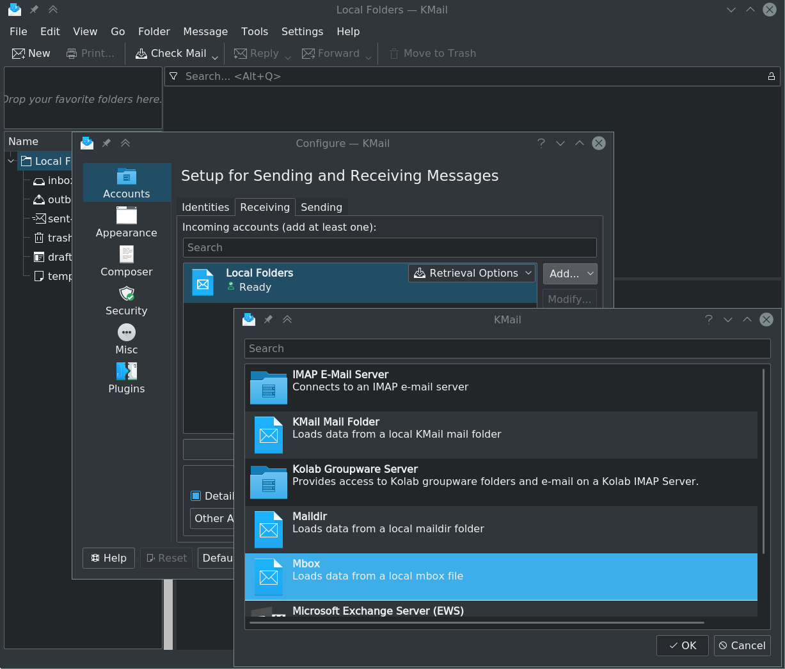
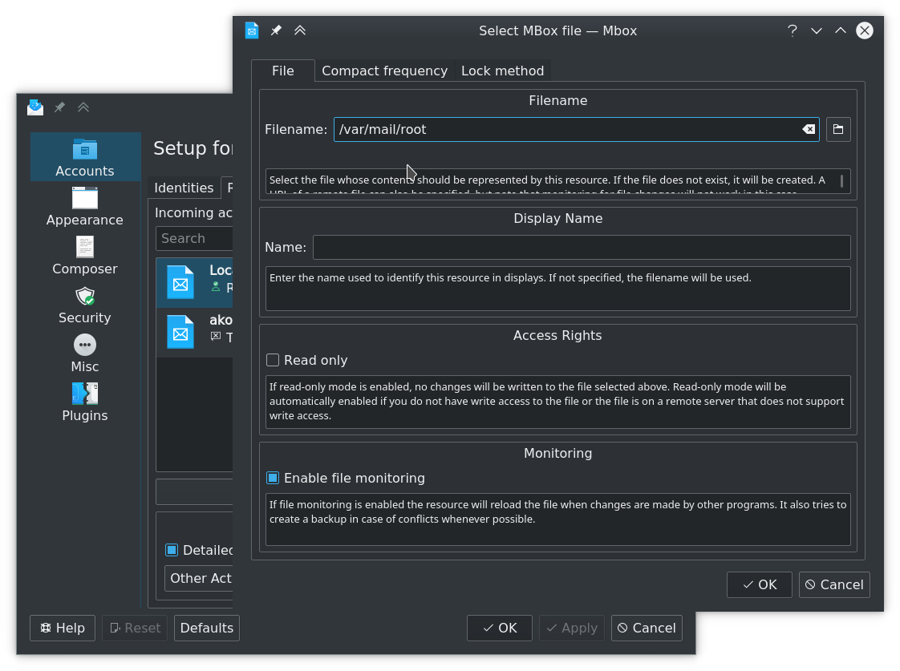
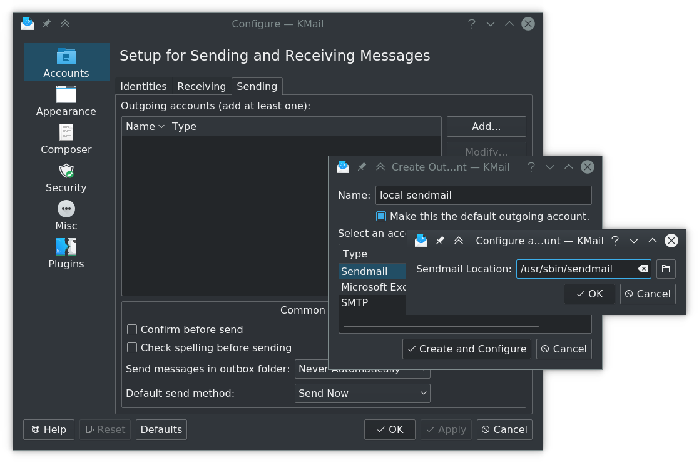
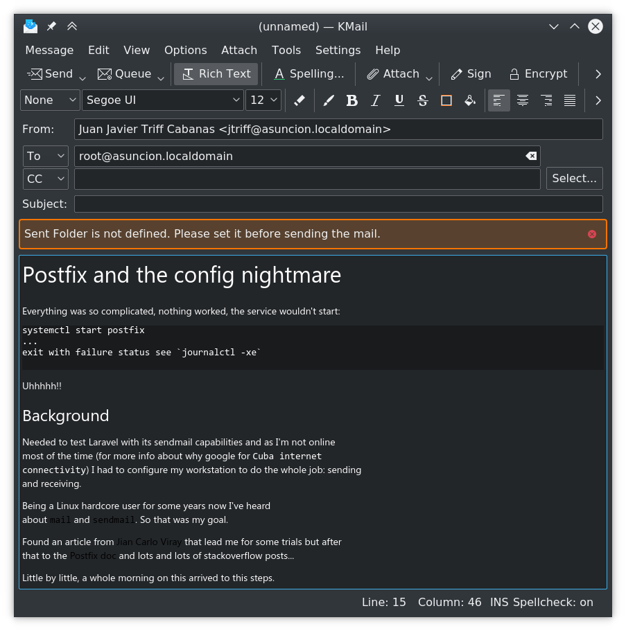
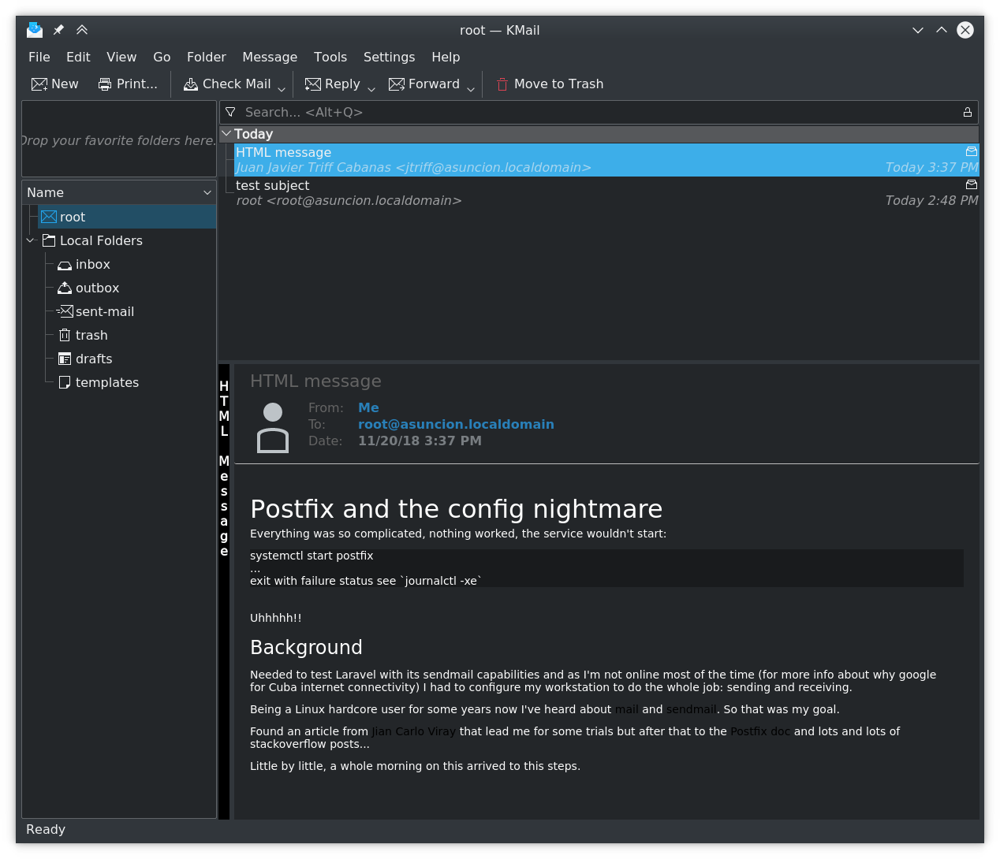

# Postfix and the config nightmare

Everything was so complicated, nothing worked, the service wouldn't start:

    systemctl start postfix
    ...
    exit with failure status see `journalctl -xe`

Uhhhhh!! 

## Background

Needed to test Laravel with its sendmail capabilities and as I'm not online most of the time (for more info about why google for `Cuba internet connectivity`) I had to configure my workstation to do the whole job: sending and receiving.

Being a Linux hardcore user for some years now I've heard about `mail` and `sendmail`. So that was my goal.

Found an article from [Jian Carlo Viray](http://www.jancarloviray.com/blog/send-email-in-linux-without-an-smtp-server/) that lead me for some trials but after that to the [Postfix doc](http://www.postfix.com/BASIC_CONFIGURATION_README.html) and lots and lots of stackoverflow posts...

Little by little, a whole morning on this arrived to this steps.


## Simple straight forward steps

1. Install postfix with your distro default method:

    ```
    # pacman -S postfix
    ```


1. You now have 1 new user on your system:
    ```
    $ tail /etc/passwd
    ...
    jtriff:x:1000:1001:Juan Javier Triff Cabanas:/home/jtriff:/bin/zsh
    systemd-journal-remote:x:994:994:systemd Journal Remote:/:/sbin/nologin
    systemd-coredump:x:993:993:systemd Core Dumper:/:/sbin/nologin
    postfix:x:73:73::/var/spool/postfix:/bin/false
    ```

    Is the lastone: postfix

1. You now have 2 new groups in your system:
    ```
    $ tail /etc/group
    vboxsf:x:109:
    ...    
    postdrop:x:75:
    postfix:x:73:
    ```

    The 2 lastones: `postdrop` and `postfix`. But `postdrop` is the one.

1. Start with the simplest way of debuggin postfix has:
    ```
    # postfix check 
    postsuper: fatal: scan_dir_push: open directory bounce: Permission denied
    ```
    
    This means the postfix directory is not writable by it, so:

    ```
    # chown -R postfix:postdrop /var/spool/postfix/
    ```

1. Again:
    ```
    # postfix check 
    postfix/postfix-script: warning: not owned by root: /var/spool/postfix/.
    postfix/postfix-script: warning: not owned by root: /var/spool/postfix/pid
    postfix/postfix-script: warning: not owned by group postdrop: /usr/sbin/postqueue
    postfix/postfix-script: warning: not owned by group postdrop: /usr/sbin/postdrop
    postfix/postfix-script: warning: not set-gid or not owner+group+world executable: /usr/sbin/postqueue
    postfix/postfix-script: warning: not set-gid or not owner+group+world executable: /usr/sbin/postdrop

    ```

    Correcting all of this:

    ```
    # chown root /var/spool/postfix/. /var/spool/postfix/pid
    # chgrp postdrop /usr/sbin/postqueue /usr/sbin/postdrop
    # chmod g+s /usr/sbin/postqueue /usr/sbin/postdrop
    ```

1. Again:
    ```
    # postfix check 
    ```

    Clean output means good result!! 
    
1. Lets turn it on:
    ```
    # systemctl start postfix
    # systemctl status postfix
    ● postfix.service - Postfix Mail Transport Agent
    Loaded: loaded (/usr/lib/systemd/system/postfix.service; disabled; vendor preset: enabled)
    Active: active (running) since Tue 2018-11-20 14:37:20 EST; 25s ago
    Process: 21337 ExecStart=/usr/sbin/postfix start (code=exited, status=0/SUCCESS)
    Main PID: 21404 (master)
        Tasks: 3 (limit: 4915)
    Memory: 5.7M
    CGroup: /system.slice/postfix.service
            ├─21404 /usr/lib/postfix/master -w
            ├─21405 pickup -l -t unix -u
            └─21406 qmgr -l -t unix -u

    Nov 20 14:37:20 asuncion systemd[1]: Starting Postfix Mail Transport Agent...
    Nov 20 14:37:20 asuncion postfix/master[21404]: daemon started -- version 3.3.1, configuration /etc/po>
    Nov 20 14:37:20 asuncion systemd[1]: Started Postfix Mail Transport Agent.
    ```

    As you can see after the status check the service is `active (running)`. A check on the opened ports of the host confirms it:

    ```
    # lsof -i | grep smtp
    master    21404            root   13u  IPv4 299247      0t0  TCP *:smtp (LISTEN)
    ``` 

    >**Important note** you can see there that the listening smtp port is on `all (*)` interfaces. This could be a security risk 'cause you don't want your smtp server to be opened to the public attack.
    > *In my case is not a problem* (I'm offline anyway) but be aware of this.

## Testing if it works

The first test should be against the local account. The local mailbox for the root user can be accessed with:

```
# mail
mail: /var/mail/root: No such entry, file or directory
mail version v14.9.11.  Type `?' for help
(Currently no active mailbox)
No more mail.
There are new messages in the error message ring (denoted by ERROR)
  The `errors' command manages this message ring
ERROR# ? 
```

This error shows it doesn't exists, but this is just because nobody has ever sent emails to this host. Let's send one:

```
# echo 'test' | mail -s 'test subject' root
```

Now mail shows something different:

```
# mail
mail version v14.9.11.  Type `?' for help
/var/spool/mail/root: 1 message 1 new
▸N  1 root               2018-11-20 14:48   15/496   test subject                                                                                                                                                 
? 1
[-- Message  1 -- 15 lines, 496 bytes --]:
From root@asuncion.localdomain  Tue Nov 20 14:48:46 2018
Date: Tue, 20 Nov 2018 14:48:46 -0500
To: root@asuncion.localdomain
Subject: test subject
Message-Id: <20181120194846.8E7EB10438E@asuncion.localdomain>
From: root <root@asuncion.localdomain>

test

? q
Held 1 message in /var/spool/mail/root
You have mail in /var/mail/root
```

There it is: our first mail. Lets send another to a user on this very system and peek the output from the postfix server:

```
# echo 'test' | mail -s 'subject for jtriff' jtriff
```
The server output this, that we got with `journalctl`:

```
$ journalctl -f | grep post
Nov 20 14:53:32 asuncion postfix/pickup[21405]: 87C5A1043A0: uid=0 from=<root>
Nov 20 14:53:32 asuncion postfix/cleanup[22095]: 87C5A1043A0: message-id=<20181120195332.87C5A1043A0@asuncion.localdomain>
Nov 20 14:53:32 asuncion postfix/qmgr[21406]: 87C5A1043A0: from=<root@asuncion.localdomain>, size=355, nrcpt=1 (queue active)
Nov 20 14:53:32 asuncion postfix/local[22097]: 87C5A1043A0: to=<jtriff@asuncion.localdomain>, orig_to=<jtriff>, relay=local, delay=0.06, delays=0.05/0.01/0/0, dsn=2.0.0, status=sent (delivered to mailbox)
Nov 20 14:53:32 asuncion postfix/qmgr[21406]: 87C5A1043A0: removed
```

Now jtriff has his own new email:


```
$ mail
mail version v14.9.11.  Type `?' for help
/var/spool/mail/jtriff: 1 message 1 new
▸N  1 root               2018-11-20 14:55   15/508   subject for jtriff                                                                                                                                           
? q
Held 1 message in /var/spool/mail/jtriff
```

Conclusion by now: **it works!!!! Yeeeyyyy!!!**

> **Note**: there are some other config options that would make the emails more friendly, like the domain, etc. but fall outside of the scope of this post. You can fallow the links above to get more ??detours??

## Using KMail for admin on the local mailbox

Ok. We are here: is working. But we want to enjoy a fully HTML experience of our new inbox. Gladly I use the [KDE](https://www.kde.org) ecosystem *(Awwwww! so cooooooool!!)*. In here is the KMail email client. KMail supports local mailbox through akonadi:




In there you should point to the local `mbox` file:




### Sending

The other super cool (and serious) thing of KMail: supports `sendmail`:




### Testing KMail with HTML

Ok, to be 100% sure lets do a new test but this time with HTML content. Lets use the first two sections of this very post




Sent it!

Lets see:




Okis, everything is good again, **Thanks be to God!** Now back to work :)

## Late note

This config also works for sending mails to other domains like Gmail, you can try it, just be sure to look in spam folder too.

Finally: postfix is a broad world and this is just a pinch, don't take this guide as a definitive reference, but their official doc <http://www.postfix.com>.
